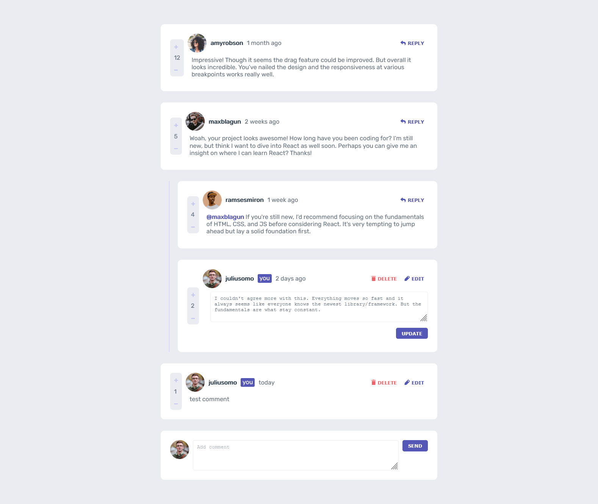

# Frontend Mentor - Interactive Comments Section

## Table of contents

- [Overview](#overview)
  - [The challenge](#the-challenge)
  - [Screenshot](#screenshot)
  - [Links](#links)
- [My process](#my-process)
  - [Built with](#built-with)
  - [Useful resources](#useful-resources)
- [Development](#development)
- [Author](#author)

## Overview

### The challenge

Users should be able to:

- View the optimal layout for the app depending on their device's screen size
- See hover states for all interactive elements on the page

### Screenshot

### Links

- Solution URL: [Github](https://github.com/3okasha/interactive-comments)
- Live Site URL: [Github Pages](https://3okasha.github.io/interactive-comments/)

## My process

### Built with

- React JS
- CSS Flexbox

### Useful resources

- [Publishing a React app on github pages](https://www.c-sharpcorner.com/article/how-to-deploy-react-application-on-github-pages/)
- [TheNetNinja Channel]()

## Development
- Use `localStorage` to save the current state in the browser that persists when the browser is refreshed.
- Using timestamps and dynamically track the time since the comment or reply was posted. Instead of using the `createdAt` strings from the `data.json` file.

## Author

- Frontend Mentor - [@Mohamed Okasha](https://www.frontendmentor.io/profile/3okasha)